# Mini-L-CTF-2021 

Team: Mini-mini-L

Members: Racer, Wushi, Hzlg

Start time: 20: 00 2021.05.06

End time: 20: 00 2021.05.06

[toc]

## Misc

### 抓猫猫 | Done | Hzlg

查找抓堆问题资料的时候，有这样一个子问题：

有一堆谷粒（例如100粒），甲乙轮流抓，每次可抓1-5粒，甲先抓，规定谁抓到最后一把谁赢。甲应该如何抓？为什么？
先不考虑100粒的问题，假如谷粒只有一粒，甲一次就可以抓完，直接获胜。两粒，三粒，四粒，五粒也是同样的情况。但是如果谷粒有六粒的话，甲一次性无法抓完，乙必然会赢。
那怎么样甲才能稳赢呢，就是在最后只剩六个谷粒的时候让乙先抓取，在最开始取时甲就要将剩下的谷粒数限定在六的倍数内，只要甲取完每次都是六的倍数，甲就必胜了。

在本题中，由于抓猫的数量不能超过前一次抓猫的数量，所以在猫猫数量为偶数时不能抓奇数只猫猫，否则对方只抓一只猫猫我们就输了。
所以我们需要找出一个偶数，使得我们抓完后剩余的猫猫数为该偶数的倍数即可抓住猫猫

假若说他先抓了32只猫猫，剩下了108只猫猫，我发现我抓12只的话还剩96只，96是12的倍数。这个时候他抓12，我也抓12，他抓8我就抓4，他抓10我就抓2，他抓6，我就6，他抓4我就4，他抓2我就2，就稳赢。

### 好康的硬盘 | Done | Racer & Wushi

搜索“文本文件隐写”，发现零宽度字符隐写方法。在vim中发现特殊字符。[在线解密](http://330k.github.io/misc_tools/unicode_steganography.html)，得到：`minil****`。

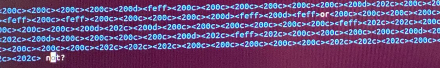

用`john`爆破后四位，指定自己的字典，得到解压密码：`minil4396`。

用`Partitionguru`提取出一个视频和一封邮件，视频用pr提取出一串数字：`7355608`。在用google搜索`Senate bill 1621 ; Title 3 , Section 303 `时，发现这类邮件加密的解密网站：[spammimic - decode](https://www.spammimic.com/decode.cgi)，以`7355608`为key，解密得：`MiniLCTF{n3ver_g0nna_L3t_Y0u_dowN}`。

## Reverse

### sub | Done | Wushi

> hint: puppet process
>
> [傀儡进程脱壳三步曲](https://blog.csdn.net/weixin_30394251/article/details/96275012?utm_medium=distribute.pc_relevant.none-task-blog-2%7Edefault%7EBlogCommendFromMachineLearnPai2%7Edefault-2.vipsorttest&depth_1-utm_source=distribute.pc_relevant.none-task-blog-2%7Edefault%7EBlogCommendFromMachineLearnPai2%7Edefault-2.vipsorttest)

#### DUMP傀儡进程

> 傀儡进程的实现
>
> 1.通过CreateProcess创建进程，传入参数CREATE_SUSPENDED使进程挂起
> 
> 2.通过NtUnmapViewOfSection清空新进程的内存数据（ZwUnmapViewOfSection）
> 
> 3.通过VirtualAllocEx申请新的内存
> 
> 4.通过WriteProcessMemory向内存写入payload
> 
> 5.通过SetThreadContext设置入口点
> 
> 6.通过ResumeThread唤醒进程，执行payload

##### 在IDA中确定ResumeThread的位置

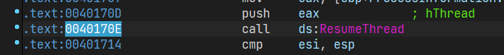

x32dbg断到此处

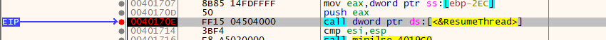

##### PCHunter `dump`傀儡进程（右键--查看--查看进程内存

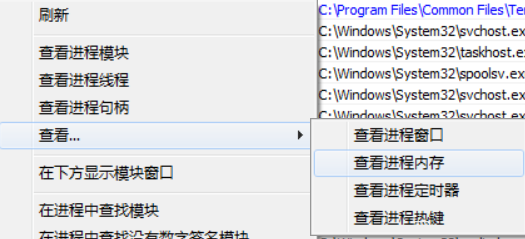

保存为`.exe`文件，此时该文件还不可执行，

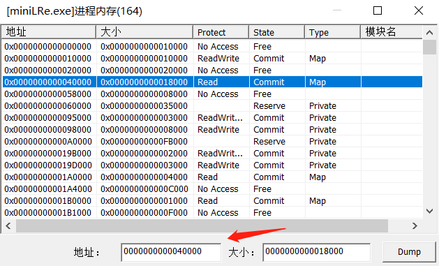

##### 修正区段信息--LoadPE载入dump后的程序，查看区段信息

类似这样

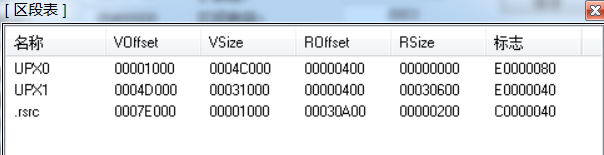

修改

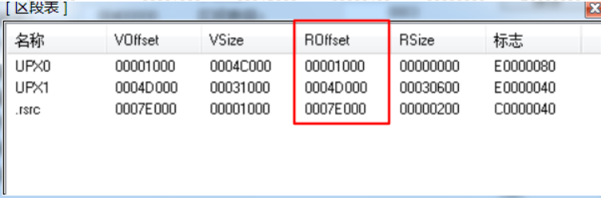

成功dump下傀儡进程，程序可以运行了。

#### IDA分析

main函数直接从off_40A040进去

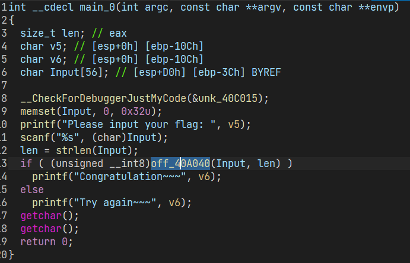

一直跟到`fuck_4014F0`(已重命名):

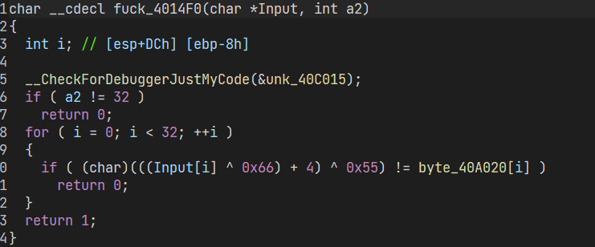

提取数据解出`mInILctf[TH1s_1s_tH4_faK4_f1ag!}`

提交flag，flag不正确，继续分析。

在fuck函数的数据地址上方发现可疑数据

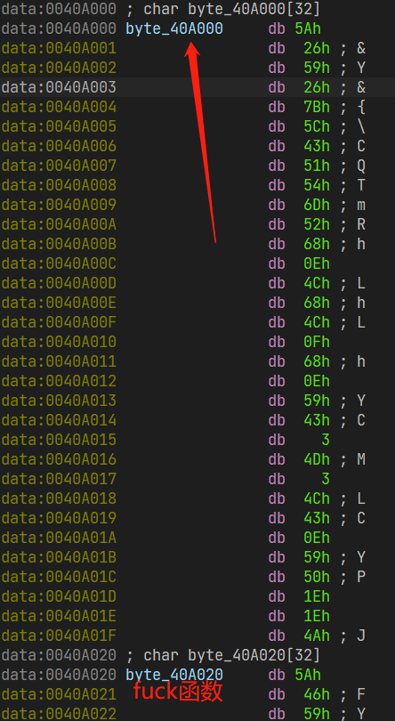

交叉引用追踪到`real_4016D0`函数(已重命名)：

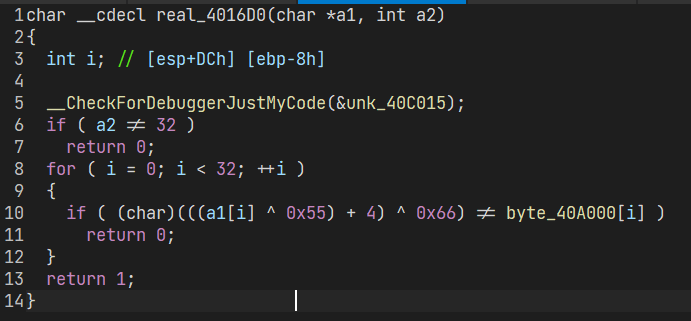

提取数据解密得flag：`miniLctf{Re_1s_s0_1nt4r4st1ng!!}`

```python
data = [0x5A, 0x26, 0x59, 0x26, 0x7B, 0x5C, 0x43, 0x51, 0x54, 0x6D, 0x52, 0x68, 0x0E, 0x4C, 0x68, 0x4C, 0x0F, 0x68, 0x0E, 0x59, 0x43, 0x3, 0x4D, 0x3, 0x4C, 0x43, 0x0E, 0x59, 0x50, 0x1E, 0x1E, 0x4A]
for i in data:
    temp = ((i ^ 0x66) - 4) ^ 0x55
    print(chr(temp), end='')
```

#### 注

- PEHunter在我的win10上起不来（版本问题），于是装了win10-1703版的虚拟机；
- 可执行文件所在目录添加动态链接库，不然文件运行不了，也无法调试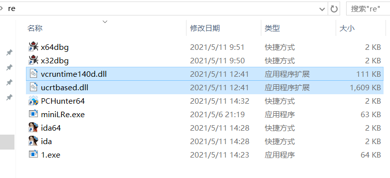


### 0oooops | Done | Wushi

`main_0`：

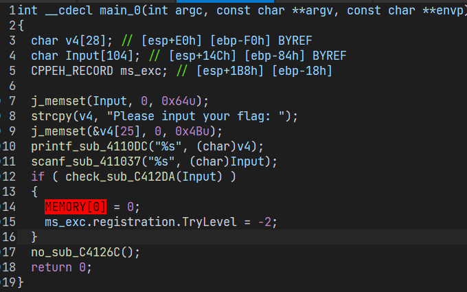

`check_sub_C412DA`函数一直跟进去，发现是验证flag头和尾：

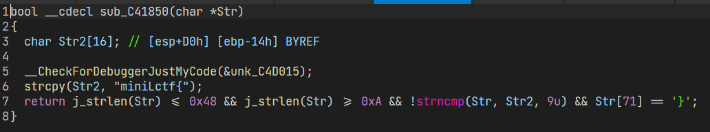

没啥思路，翻函数时发现两个可疑函数：`mark_sub_C41BD0`，`mark_sub_C41DD0`。

`mark_sub_C41BD0`：

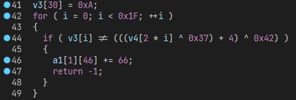

猜测v4是我们输入的字符数组，提取数据，可以解出一半的flag。

`mark_sub_C41BD0`：

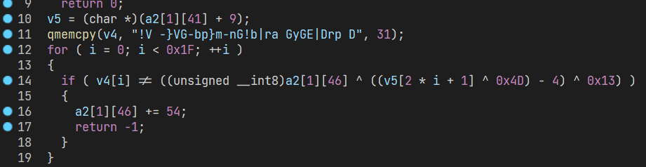

a2[1]\[46]未知，提取数据，爆破这一个字节，得到另一半flag。

```python
data1 = '10 4 18 0B 18 10 4 15 0B 5 1F 2E 21 2E 48 15 6 2E 11 45 5 3E 2E 18 15 48 2E 45 21 1F 0A'.split(' ')
data2 = '!V -}VG-bp}m-nG!b|ra GyGE|Drp D'
data2 = [data2[i: i+1] for i in range(len(data2))]
for i in range(len(data1)):
    data1[i] = ((int(data1[i], 16) ^ 0x42) - 4) ^ 0x37
    # print(chr(data1[i]), end=' ')
for magic in range(0, 127):
    for i in range(len(data2)):
        flag2 = 0x4d ^ (4 + (0x13 ^ ord(data2[i]) ^ magic))
        print(chr(data1[i]) + chr(flag2), end='')
    print()
```

`miniLctf{y0u_a1r4ady_und4rstand_th4_w1nd0ws_exc4pt1On_handl1e_m4chan1sm}`

